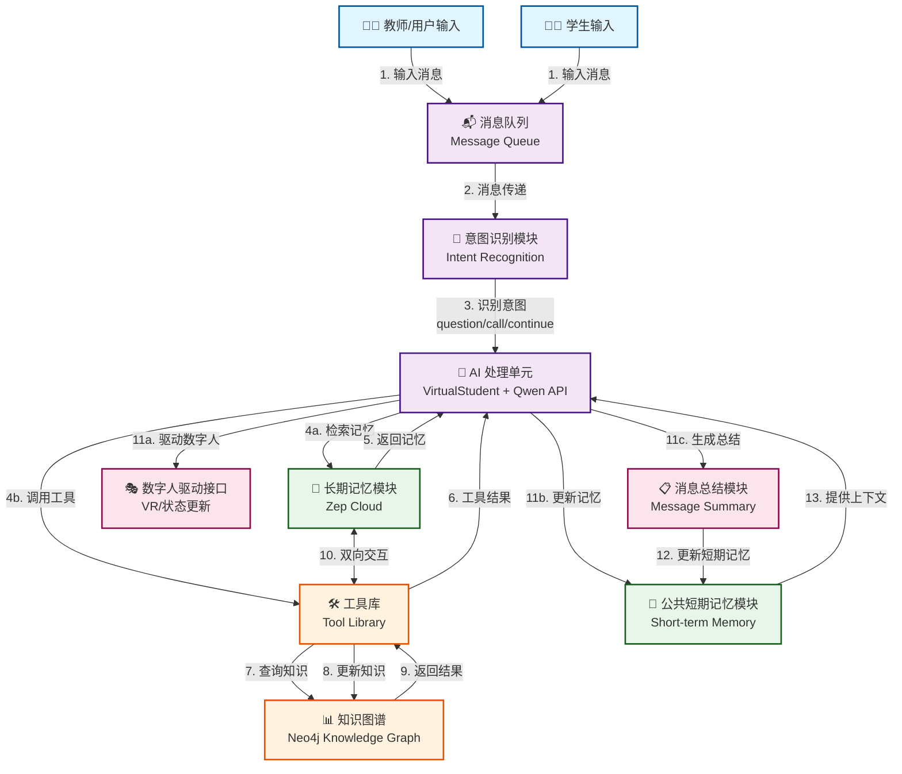

# 具有长期记忆和知识图谱的虚拟学生系统

一个基于 [Zep Cloud](https://getzep.com/) 记忆管理、[Qwen API](https://dashscope.aliyuncs.com/) 对话生成、[LangGraph](https://langchain-ai.github.io/langgraph/) 状态管理和 [Neo4j](https://neo4j.com/) 知识图谱的智能虚拟学生系统。

## 📖 目录

- [系统概述](#系统概述)
- [功能特性](#功能特性)
- [系统架构](#系统架构)
- [工作流程](#工作流程)
- [核心概念](#核心概念)
- [环境要求](#环境要求)
- [安装配置](#安装配置)
- [使用方法](#使用方法)
- [项目结构](#项目结构)
- [核心组件](#核心组件)
- [API 接口](#api-接口)
- [前端功能](#前端功能)
- [使用示例](#使用示例)
- [故障排除](#故障排除)
- [相关文档](#相关文档)

## 🎯 系统概述

本系统是一个智能虚拟学生系统，能够模拟真实学生的学习行为，包括：
- **多学生支持**：支持多个虚拟学生同时参与课堂对话
- **个性化知识图谱**：每个学生拥有独立的知识图谱，记录其学习进度
- **三维掌握向量**：使用 `[m, u, c]` 三维向量表示知识点的掌握程度
- **长期记忆管理**：基于 Zep Cloud 的长期记忆系统
- **智能对话**：基于 Qwen API 的自然语言对话能力
- **知识图谱可视化**：Web 界面可视化和管理知识图谱

## 🚀 功能特性

### 1. 虚拟学生对话系统

#### 多学生管理
- 支持 6 个预设学生：崔展豪、李昌龙、包梓群、丽娃、张晓丹、萧华诗
- 每个学生拥有独立的状态、记忆和知识图谱
- 支持学生起立发言、坐下等行为状态

#### 智能对话
- **意图识别**：自动识别老师的问题、点名、继续等意图
- **状态管理**：跟踪学生的动作状态（举手、端坐、起立、坐下）和表情状态（平静、困惑、微笑）
- **积极性调节**：动态调整学生的积极性（0-1），影响回答风格
- **记忆检索**：自动检索长期记忆和知识图谱回答问题

#### 语音识别（可选）
- 集成 FunASR 语音识别服务
- 支持实时语音转文字
- 支持热词配置和 ITN（逆文本规范化）

### 2. 知识图谱管理系统

#### 学生特定知识图谱
- **标签隔离**：每个学生的知识图谱使用独立的 Neo4j 标签（如 `KnowledgePoint_Cuizhanhao`）
- **版本控制**：通过 `index.json` 管理每个学生的多个版本知识图谱
- **导入导出**：支持从 JSON 文件导入和导出到 JSON 文件

#### 三维掌握向量
每个知识点的掌握状态用三维向量 `[m, u, c]` 表示：
- **m (记忆/理解)**：记忆和理解层面的掌握程度（0 或 1）
- **u (应用/分析)**：应用和分析层面的掌握程度（0 或 1）
- **c (评价/创造)**：评价和创造层面的掌握程度（0 或 1）

向量规则：
- 每个维度只能是 `0`（未掌握）或 `1`（已掌握）
- 任意一维为 `1` 时，节点标记为"已学习"（绿色）
- 全为 `0` 时，节点标记为"未学习"（灰色）

#### 知识检索与更新
- **相似度搜索**：基于 Jaro-Winkler 距离算法的模糊匹配
- **条件展示**：根据掌握向量决定是否展示知识点描述和问答对
- **智能过滤**：只展示与已掌握层级相关的 Bloom 问答对

### 3. 知识图谱可视化系统

#### 可视化功能
- **交互式图谱**：基于 vis.js 的交互式知识图谱可视化
- **年级聚合**：按年级自动聚合节点，支持双击展开
- **状态着色**：根据掌握向量自动为节点着色（绿色=已学习，灰色=未学习）
- **节点详情**：点击节点查看详细信息，包括描述、Bloom 问答对等

#### 版本管理
- **版本选择**：通过下拉框选择不同学生的不同版本知识图谱
- **版本比较**：比较两个版本之间的差异，显示状态向量变化
- **设置当前版本**：将任意版本设置为当前版本

#### 编辑功能
- **节点编辑**：编辑节点的描述、Bloom 问答对、掌握向量等
- **边编辑**：编辑边的类型、描述等属性
- **实时保存**：修改后实时保存到对应的 JSON 文件

### 4. 长期记忆系统（Zep Cloud）

- **自动检索**：检索历史对话内容和相关事实
- **图搜索**：支持事实和节点的图搜索功能
- **上下文管理**：智能维护对话上下文
- **记忆持久化**：长期保存学生的学习历史和对话记录

## 🏗️ 系统架构

```
┌─────────────────────────────────────────────────────────────┐
│                      Web 前端界面                            │
│  ┌──────────────────┐        ┌──────────────────────┐     │
│  │   对话界面        │        │  知识图谱可视化       │     │
│  │  (index.html)    │        │  (kg_visualization)  │     │
│  └──────────────────┘        └──────────────────────┘     │
└─────────────────────────────────────────────────────────────┘
                            │
                            ▼
┌─────────────────────────────────────────────────────────────┐
│                    Flask Web 应用层                          │
│  ┌──────────────────┐        ┌──────────────────────┐     │
│  │  run_student.py  │        │  visualization.py   │     │
│  │  (端口 8080)     │        │  (端口 8081)         │     │
│  └──────────────────┘        └──────────────────────┘     │
└─────────────────────────────────────────────────────────────┘
                            │
        ┌───────────────────┼───────────────────┐
        ▼                   ▼                   ▼
┌──────────────┐   ┌──────────────┐   ┌──────────────┐
│  VirtualStudent│   │KnowledgeGraph│   │  Zep Client  │
│   (LangGraph) │   │   Manager     │   │  (长期记忆)  │
└──────────────┘   └──────────────┘   └──────────────┘
        │                   │                   │
        └───────────────────┼───────────────────┘
                            ▼
        ┌───────────────────────────────────────┐
        │         Qwen API (对话生成)            │
        └───────────────────────────────────────┘
                            │
                            ▼
        ┌───────────────────────────────────────┐
        │         Neo4j (知识图谱存储)           │
        │  - KnowledgePoint_Cuizhanhao          │
        │  - KnowledgePoint_Lichanglong         │
        │  - ...                                │
        └───────────────────────────────────────┘
```

## 🔄 工作流程

系统的工作流程展示了从用户输入到最终响应的完整处理过程：



### 流程说明

#### 1. 输入阶段
- **教师/用户输入**：教师通过 Web 界面发送消息（文本或语音）
- **学生输入**：虚拟学生接收输入并准备处理

#### 2. 消息处理阶段
- **消息队列**：接收并缓冲所有输入消息
- **意图识别模块**：分析消息内容，识别意图类型：
  - `question`：提问
  - `call`：点名
  - `continue`：继续讲解
  - `sit_down`：让学生坐下

#### 3. AI 处理阶段（核心）
- **AI 处理单元**：`VirtualStudent` 类结合 Qwen API 进行智能处理
  - 根据意图和上下文决定处理策略
  - 动态调用工具和检索记忆
  - 生成合适的回复

#### 4. 记忆和工具调用阶段
- **长期记忆模块**（Zep Cloud）：
  - 检索历史对话和事实
  - 提供上下文信息
  - 与工具库双向交互
  
- **工具库**：
  - `recall_knowledge_vector_tool`：检索知识点和掌握向量
  - `update_knowledge_vector_tool`：更新知识点掌握状态
  - `search_memory_comprehensive`：综合记忆检索
  
- **知识图谱**（Neo4j）：
  - 存储学生特定的知识图谱
  - 支持相似度搜索
  - 管理三维掌握向量

#### 5. 输出阶段
- **数字人驱动接口**：
  - 更新学生状态（动作、表情）
  - 发送 VR 事件（可选）
  - 控制学生行为表现
  
- **消息总结模块**：
  - 总结对话内容
  - 提取关键信息
  - 更新短期记忆

#### 6. 记忆更新阶段
- **公共短期记忆模块**：
  - 存储最近 10 条对话
  - 为后续对话提供上下文
  - 定期刷新到长期记忆

### 关键特性

1. **状态管理**：使用 LangGraph 的 `add_messages` 自动管理消息列表，避免重复
2. **工具调用循环**：支持多轮工具调用，直到获得最终答案
3. **记忆分层**：短期记忆（快速访问）和长期记忆（持久存储）相结合
4. **个性化学习**：每个学生拥有独立的知识图谱和记忆空间
5. **实时响应**：异步处理确保系统响应速度

## 💡 核心概念

### 1. 学生标签映射

系统支持中文学生名，但在 Neo4j 中使用英文标签：

| 中文名 | 英文标签 | Neo4j 标签 |
|--------|---------|------------|
| 崔展豪 | Cuizhanhao | KnowledgePoint_Cuizhanhao |
| 李昌龙 | Lichanglong | KnowledgePoint_Lichanglong |
| 包梓群 | Baoziqun | KnowledgePoint_Baoziqun |
| 丽娃 | Liwa | KnowledgePoint_Liwa |
| 张晓丹 | Zhangxiaodan | KnowledgePoint_Zhangxiaodan |
| 萧华诗 | Xiaohuashi | KnowledgePoint_Xiaohuashi |

### 2. 知识图谱版本管理

知识图谱文件存储在 `data/student_graphs/<学生名>/<时间戳>.json`，版本信息由 `data/student_graphs/index.json` 管理：

```json
{
  "崔展豪": {
    "current_stage": "20251116_112240",
    "stages": {
      "20251115_211822": "data/student_graphs/崔展豪/20251115_211822.json",
      "20251116_100003": "data/student_graphs/崔展豪/20251116_100003.json",
      "20251116_112240": "data/student_graphs/崔展豪/20251116_112240.json"
    }
  }
}
```

### 3. 掌握向量与内容展示

系统根据掌握向量 `[m, u, c]` 决定展示内容：

- **全 0 向量**：不展示描述和问答，仅提示"尚未掌握"
- **m > 0**：展示描述，仅展示"记忆/理解"层级的问答
- **u > 0**：展示描述，仅展示"应用/分析"层级的问答
- **c > 0**：展示描述，仅展示"评价/创造"层级的问答

### 4. Bloom 分类法问答对

每个知识点包含多个 Bloom 分类法问答对，每个问答对包含：
- `level` / `level_zh`：层级（记忆/理解/应用/分析/评价/创造）
- `question`：问题
- `answer`：答案

## 📋 环境要求

- **Python**: 3.8+
- **Neo4j**: 5.0+ (本地或云端)
- **Zep Cloud**: 账户和 API 密钥
- **Qwen API**: 阿里云通义千问 API 密钥
- **FunASR** (可选): 语音识别服务

## 🛠️ 安装配置

### 1. 克隆项目

```bash
git clone <your-repo-url>
cd ZEP
```

### 2. 创建虚拟环境（推荐）

```bash
python3 -m venv .venv
source .venv/bin/activate  # Linux/Mac
# 或
.venv\Scripts\activate  # Windows
```

### 3. 安装依赖

```bash
pip install -r requirements.txt
```

主要依赖包括：
- `zep-cloud>=3.0.0` - Zep 长期记忆
- `langgraph>=0.2.0` - 状态管理工作流
- `langchain-core>=0.3.0` - LangChain 核心
- `neo4j>=5.0.0` - Neo4j 数据库驱动
- `jellyfish>=1.2.0` - 相似度算法
- `flask>=2.3.0` - Web 框架
- `flask-cors>=4.0.0` - CORS 支持
- `rich>=13.0.0` - 终端美化

### 4. 环境配置

创建 `.env` 文件（或复制 `env_template.txt`）：

```bash
# Zep Cloud API 密钥
ZEP_API_KEY=your_zep_api_key_here

# Qwen API 配置
QWEN_API_KEY=your_qwen_api_key_here
QWEN_BASE_URL=https://dashscope.aliyuncs.com/compatible-mode/v1
QWEN_MODEL=qwen-max

# Neo4j 配置
NEO4J_URI=bolt://localhost:7687
NEO4J_USERNAME=neo4j
NEO4J_PASSWORD=your_neo4j_password

# 可选配置
BOT_NAME=智能助手
TEMPERATURE=0.7
MAX_TOKENS=2000
TIMEOUT=30

# FunASR 语音识别配置（可选）
FUNASR_HOST=59.78.189.185
FUNASR_PORT=9999
FUNASR_MODE=2pass
FUNASR_CHUNK_SIZE=2,8,3
FUNASR_CHUNK_INTERVAL=8
FUNASR_USE_ITN=1
FUNASR_USE_SSL=0
FUNASR_SSL_VERIFY=0
```

### 5. 启动 Neo4j 数据库

确保 Neo4j 数据库正在运行：

```bash
# 使用 Docker 启动（推荐）
docker run -d \
  --name neo4j \
  -p 7474:7474 -p 7687:7687 \
  -e NEO4J_AUTH=neo4j/your_password \
  neo4j:latest

# 或使用本地安装的 Neo4j
neo4j start
```

默认配置：
- URI: `bolt://localhost:7687`
- 用户名: `neo4j`
- 密码: 在 `.env` 中配置

### 6. 导入初始知识图谱

如果有初始知识图谱 JSON 文件，可以使用 `KnowledgeGraphManager` 导入：

```python
from knowledge_graph_manager import KnowledgeGraphManager

# 导入通用知识图谱
kgm = KnowledgeGraphManager()
kgm.import_student_graph_from_file(None, "data/小学数学图谱_v3.json", clear_existing=False)

# 导入特定学生的知识图谱
kgm = KnowledgeGraphManager(student_label_en="Cuizhanhao")
kgm.import_student_graph_from_file("Cuizhanhao", "data/student_graphs/崔展豪/20251115_211822.json", clear_existing=True)
```

### 7. 获取 API 密钥

#### Zep Cloud API 密钥
1. 访问 [Zep Cloud](https://getzep.com/)
2. 注册账户并创建项目
3. 在项目设置中获取 API 密钥
4. 将密钥添加到 `.env` 文件的 `ZEP_API_KEY`

#### Qwen API 密钥
1. 访问 [阿里云通义千问](https://dashscope.aliyuncs.com/)
2. 注册账户并开通服务
3. 获取 API 密钥
4. 将密钥添加到 `.env` 文件的 `QWEN_API_KEY`

## 🎯 使用方法

### 1. 启动虚拟学生对话系统

```bash
python3 run_student.py
```

系统将在 `http://localhost:8080` 启动 Web 界面。

**功能**：
- 教师与多个虚拟学生对话
- 学生起立发言、坐下等行为
- 自动识别意图（提问、点名、继续等）
- 知识图谱导入/导出

### 2. 启动知识图谱可视化系统

```bash
python3 visualization.py
```

系统将在 `http://localhost:8081` 启动可视化界面。

**功能**：
- 可视化知识图谱
- 按年级聚合节点
- 编辑节点和边
- 版本管理和比较

### 3. 使用 Python API

```python
from src.student.virtual_student import VirtualStudent
from knowledge_graph_manager import KnowledgeGraphManager

# 创建虚拟学生实例
student = VirtualStudent(
    student_name="崔展豪",
    zep_api_key="your_zep_key",
    qwen_api_key="your_qwen_key"
)

# 创建学生用户和对话线程
student_id = await student.create_student_user("崔展豪", "cuizhanhao@student.com")
thread_id = await student.create_study_thread(student_id)

# 处理对话
response = await student.process_message(thread_id, "老师：什么是乘法分配律？")
print(response)

# 管理知识图谱
kgm = KnowledgeGraphManager(student_label_en="Cuizhanhao")
results = kgm.find_similar_knowledge_points("乘法分配律", top_n=3)
for r in results:
    print(f"{r['node_name']}: {r['status']}")
```

## 📁 项目结构

```
CE-EduAgent/
├── run_student.py              # 虚拟学生对话系统（Flask，端口 8080）
├── visualization.py            # 知识图谱可视化系统（Flask，端口 8081）
├── knowledge_graph_manager.py   # Neo4j 知识图谱管理器
├── requirements.txt            # Python 依赖包
├── README.md                   # 项目文档
│
├── src/                        # 源代码目录
│   ├── api/
│   │   └── qwen_client.py      # Qwen API 客户端
│   ├── config/
│   │   └── settings.py         # 配置管理
│   ├── memory/
│   │   └── short_term_memory.py # 短期记忆管理
│   ├── services/
│   │   ├── funasr_ws.py        # FunASR 语音识别服务
│   │   └── vr_client.py        # VR 客户端（可选）
│   ├── student/
│   │   ├── virtual_student.py  # 虚拟学生核心类
│   │   ├── student_state.py    # 学生状态定义
│   │   └── system_prompts.py   # 系统提示词
│   └── tools/
│       ├── knowledge_tools.py   # 知识库工具（检索/更新）
│       └── zep_tools.py        # Zep 记忆工具
│
├── templates/                  # HTML 模板
│   ├── index.html             # 对话界面
│   └── kg_visualization.html   # 知识图谱可视化界面
│
├── static/                     # 静态资源
│   ├── css/
│   │   ├── style.css          # 对话界面样式
│   │   └── kg_style.css       # 知识图谱样式
│   └── js/
│       ├── app.js             # 对话界面逻辑
│       └── kg_visualization.js # 知识图谱可视化逻辑
│
├── data/                       # 数据目录
│   ├── student_graphs/        # 学生知识图谱
│   │   ├── index.json         # 版本索引文件
│   │   ├── 崔展豪/
│   │   │   ├── 20251115_211822.json
│   │   │   └── 20251116_100003.json
│   │   ├── 李昌龙/
│   │   └── ...
│   └── 小学数学图谱_v3.json   # 初始知识图谱
│
├── uploads/                    # 上传文件目录（语音等）
└── tools/                      # 工具脚本
    └── funasr_ws_client.py     # FunASR 客户端示例
```

## 🔧 核心组件

### 1. KnowledgeGraphManager (`knowledge_graph_manager.py`)

Neo4j 知识图谱管理器，提供以下功能：

#### 主要方法

- `__init__(student_label_en=None)`: 初始化，支持学生特定标签
- `find_similar_knowledge_points(name, top_n=3)`: 相似度搜索
- `update_knowledge_vector(uuid, index, value)`: 更新掌握向量某一维
- `import_student_graph_from_file(student_label_en, file_path, clear_existing=False)`: 从 JSON 导入
- `export_student_graph(student_label_en)`: 导出为 JSON

#### 状态向量管理

- `_ensure_status_vector(val)`: 规范化状态向量为 `[m, u, c]`，确保值为 `0` 或 `1`
- 兼容历史数据：`int` 映射为 `[int, 0, 0]`，`None` 映射为 `[0, 0, 0]`

### 2. VirtualStudent (`src/student/virtual_student.py`)

虚拟学生核心类，管理学生的对话、记忆和工具调用。

#### 主要功能

- **学生管理**：创建学生用户、对话线程
- **记忆管理**：集成 Zep 长期记忆和短期记忆
- **工具调用**：知识检索、更新工具
- **LangGraph 工作流**：状态管理和工具调用流程

#### 工具集成

- `recall_knowledge_vector_tool`: 检索知识点和掌握向量
- `update_knowledge_vector_tool`: 更新掌握向量
- `search_memory_comprehensive`: 检索长期记忆

### 3. 知识库工具 (`src/tools/knowledge_tools.py`)

AI 模型可调用的工具函数。

#### recall_knowledge_vector_tool

检索知识点，返回：
- 知识点基本信息（名称、年级、学科）
- 三维掌握向量 `[m, u, c]`
- 条件展示的描述和问答对（根据掌握向量过滤）

#### update_knowledge_vector_tool

更新知识点的掌握向量某一维：
- `name`: 知识点名称（模糊匹配）
- `index`: 维度索引（0=m, 1=u, 2=c）
- `value`: 新值（0 或 1）

### 4. 系统提示词 (`src/student/system_prompts.py`)

定义虚拟学生的行为规则和工具使用说明。

#### 基础提示词

- 学生角色定位
- 积极性影响
- 记忆使用规则

#### 认知增强提示词

- 掌握向量解释
- 工具使用指南
- 回答策略（根据掌握程度调整回答风格）

## 🌐 API 接口

### run_student.py (端口 8080)

#### 对话相关

- `POST /api/chat`: 处理教师消息，返回学生回复
- `POST /api/audio/upload`: 上传语音文件进行识别
- `GET /api/students`: 获取所有学生列表和状态

#### 知识图谱管理

- `GET /api/graph/index`: 获取版本索引 (`index.json`)
- `POST /api/graph/import_latest`: 导入指定学生的最新知识图谱到 Neo4j
- `POST /api/graph/export`: 导出当前 Neo4j 图谱为 JSON，更新 `index.json`
- `GET /api/kg/graph`: 获取指定学生和版本的知识图谱数据
- `POST /api/graph/set_current`: 设置指定版本为当前版本

### visualization.py (端口 8081)

#### 知识图谱操作

- `GET /api/kg/load`: 加载知识图谱（兼容旧接口）
- `GET /api/graph/index`: 获取版本索引
- `GET /api/kg/graph`: 获取指定学生和版本的知识图谱
- `POST /api/graph/set_current`: 设置当前版本
- `POST /api/kg/node/update`: 更新节点属性
- `POST /api/kg/edge/update`: 更新边属性

## 🖥️ 前端功能

### 对话界面 (`templates/index.html`)

#### 主要功能

1. **多学生对话**
   - 显示所有学生的状态（动作、表情、积极性）
   - 支持学生起立发言
   - 自动识别意图并触发相应行为

2. **知识图谱管理**
   - 导入最新知识图谱（按学生）
   - 导出当前知识图谱（按学生）
   - 显示导入/导出进度和结果

3. **消息显示**
   - 区分教师消息和学生回复
   - 显示课堂助手消息
   - 支持语音输入（可选）

### 知识图谱可视化 (`templates/kg_visualization.html`)

#### 主要功能

1. **版本选择**
   - 学生下拉框：选择要查看的学生
   - 版本下拉框：选择该学生的版本
   - 比较版本下拉框：选择要比较的版本

2. **图谱操作**
   - **加载图谱**：加载选中的学生和版本
   - **设为当前**：将选中版本设为当前版本
   - **生成比较摘要**：比较两个版本的差异

3. **可视化功能**
   - **年级聚合**：初始视图按年级聚合节点
   - **双击展开**：双击年级节点展开该年级的所有节点
   - **节点着色**：绿色=已学习（任意一维为 1），灰色=未学习（全 0）
   - **节点详情**：点击节点查看详细信息
   - **节点编辑**：编辑节点的描述、问答对、掌握向量

4. **比较功能**
   - 显示两个版本之间的状态向量变化
   - 仅显示有变化的节点
   - 格式化显示，包含表情符号

## 💡 使用示例

### 示例 1: 基础对话

```python
from src.student.virtual_student import VirtualStudent

# 创建虚拟学生
student = VirtualStudent(
    student_name="崔展豪",
    zep_api_key="your_key",
    qwen_api_key="your_key"
)

# 初始化
student_id = await student.create_student_user("崔展豪", "test@example.com")
thread_id = await student.create_study_thread(student_id)

# 对话
response = await student.process_message(thread_id, "老师：什么是分数？")
print(response)
```

### 示例 2: 知识图谱操作

```python
from knowledge_graph_manager import KnowledgeGraphManager

# 创建管理器（指定学生）
kgm = KnowledgeGraphManager(student_label_en="Cuizhanhao")

# 搜索知识点
results = kgm.find_similar_knowledge_points("分数", top_n=3)
for r in results:
    print(f"{r['node_name']}: {r['status']}")

# 更新掌握向量（将"记忆/理解"维度设为 1）
kgm.update_knowledge_vector(
    uuid=results[0]['uuid'],
    index=0,  # m 维度
    value=1
)

# 导出知识图谱
data = kgm.export_student_graph("Cuizhanhao")
import json
with open("exported_graph.json", "w", encoding="utf-8") as f:
    json.dump(data, f, ensure_ascii=False, indent=2)
```

### 示例 3: 批量导入知识图谱

```python
from knowledge_graph_manager import KnowledgeGraphManager
import json
import os

# 读取版本索引
with open("data/student_graphs/index.json", "r", encoding="utf-8") as f:
    index = json.load(f)

# 为每个学生导入最新版本
for student_cn, info in index.items():
    current_stage = info.get("current_stage")
    if not current_stage:
        continue
    
    # 获取文件路径
    file_path = info["stages"][current_stage]
    abs_path = os.path.join("data/student_graphs", file_path)
    
    # 映射中文名到英文标签
    label_map = {
        "崔展豪": "Cuizhanhao",
        "李昌龙": "Lichanglong",
        # ... 其他映射
    }
    student_label_en = label_map.get(student_cn)
    
    if student_label_en and os.path.exists(abs_path):
        kgm = KnowledgeGraphManager(student_label_en=student_label_en)
        kgm.import_student_graph_from_file(
            student_label_en=student_label_en,
            file_path=abs_path,
            clear_existing=True
        )
        print(f"✓ 已导入 {student_cn} 的知识图谱")
```

### 示例 4: Web API 调用

```javascript
// 导入最新知识图谱
fetch('/api/graph/import_latest', {
    method: 'POST',
    headers: { 'Content-Type': 'application/json' },
    body: JSON.stringify({
        student_names: ['崔展豪', '李昌龙']
    })
})
.then(r => r.json())
.then(data => console.log(data));

// 导出当前知识图谱
fetch('/api/graph/export', {
    method: 'POST',
    headers: { 'Content-Type': 'application/json' },
    body: JSON.stringify({
        student_names: ['崔展豪']
    })
})
.then(r => r.json())
.then(data => console.log(data));
```

## 🐛 故障排除

### 常见问题

#### 1. API 密钥错误

**症状**：连接失败、认证错误

**解决方案**：
- 检查 `.env` 文件中的 API 密钥是否正确
- 确认 API 密钥有足够的权限和配额
- 检查网络连接和防火墙设置

#### 2. Neo4j 连接问题

**症状**：`Connection refused`、`Authentication failed`

**解决方案**：
```bash
# 检查 Neo4j 是否运行
docker ps | grep neo4j
# 或
neo4j status

# 测试连接
python3 -c "from neo4j import GraphDatabase; driver = GraphDatabase.driver('bolt://localhost:7687', auth=('neo4j', 'your_password')); driver.verify_connectivity(); print('连接成功')"
```

#### 3. 知识图谱导入失败

**症状**：导入时出错、节点未创建

**解决方案**：
- 检查 JSON 文件格式是否正确
- 确认文件路径和权限
- 检查 Neo4j 数据库空间是否充足
- 查看控制台错误信息

#### 4. 学生标签不匹配

**症状**：找不到学生的知识图谱

**解决方案**：
- 确认学生中文名和英文标签的映射正确
- 检查 `index.json` 中的学生名是否正确
- 确认 Neo4j 中的标签格式（如 `KnowledgePoint_Cuizhanhao`）

#### 5. 前端页面无法加载

**症状**：页面空白、JavaScript 错误

**解决方案**：
- 检查 Flask 应用是否正常运行
- 查看浏览器控制台错误信息
- 确认静态文件路径正确
- 清除浏览器缓存

#### 6. 掌握向量显示异常

**症状**：向量值不正确、颜色显示错误

**解决方案**：
- 确认向量格式为 `[m, u, c]`，每个值为 `0` 或 `1`
- 检查 `_ensure_status_vector` 函数是否正确规范化
- 刷新页面重新加载数据

### 调试模式

启用详细日志：

```bash
# 设置环境变量
export LOG_LEVEL=DEBUG
export PYTHONUNBUFFERED=1

# 运行应用
python3 run_student.py
```

查看 Neo4j 数据：

```cypher
// 查看所有学生标签
CALL db.labels() YIELD label RETURN label

// 查看特定学生的节点
MATCH (n:KnowledgePoint_Cuizhanhao) RETURN n LIMIT 10

// 查看节点的状态向量
MATCH (n:KnowledgePoint_Cuizhanhao) 
WHERE n.status IS NOT NULL 
RETURN n.node_name, n.status 
LIMIT 20
```

## 📚 相关文档

### 官方文档

- [Zep Cloud 文档](https://help.getzep.com/)
- [Zep LangGraph 集成](https://help.getzep.com/ecosystem/langgraph-memory)
- [Qwen API 文档](https://help.aliyun.com/zh/dashscope/)
- [LangGraph 文档](https://langchain-ai.github.io/langgraph/)
- [Neo4j Python 驱动](https://neo4j.com/docs/python-manual/current/)
- [vis.js 文档](https://visjs.org/)

### 算法和库

- [Jellyfish 相似度算法](https://github.com/jamesturk/jellyfish)
- [Jaro-Winkler 距离](https://en.wikipedia.org/wiki/Jaro%E2%80%93Winkler_distance)
- [Bloom 分类法](https://en.wikipedia.org/wiki/Bloom%27s_taxonomy)

### 开发工具

- [Python 环境管理](https://docs.python.org/3/tutorial/venv.html)
- [Flask 文档](https://flask.palletsprojects.com/)
- [Docker 文档](https://docs.docker.com/)

## 🤝 贡献

欢迎提交 Issue 和 Pull Request！

### 贡献指南

1. Fork 本仓库
2. 创建特性分支 (`git checkout -b feature/AmazingFeature`)
3. 提交更改 (`git commit -m 'Add some AmazingFeature'`)
4. 推送到分支 (`git push origin feature/AmazingFeature`)
5. 开启 Pull Request


